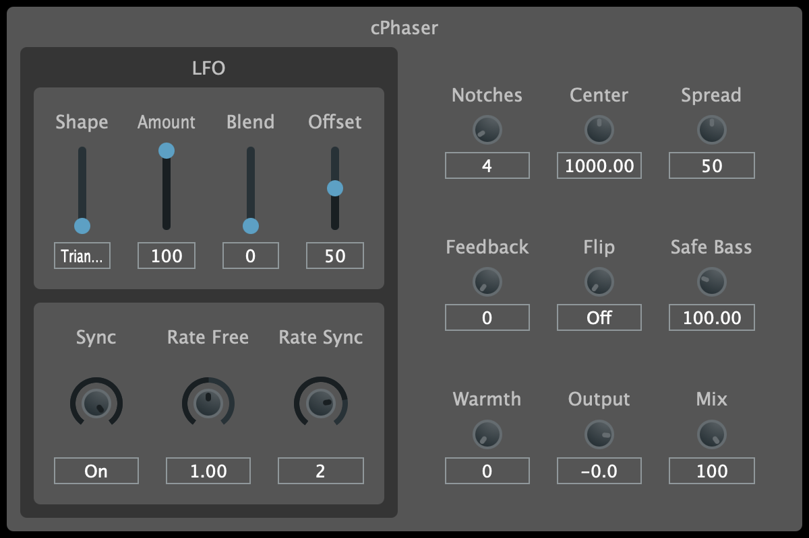

# cPhaser

<p align="center"></p>

## Overview

cPhaser is a simple phaser audio effect plugin available in VST3, AU, and CLAP formats for Mac and Windows, built using C++ and JUCE.

You can find the actual DSP code for this effect in the [cgo_modules](https://github.com/calgoheen/cgo_modules/tree/main/cgo_processors/effects) repository.

This project is inspired by the phaser audio effect found in a popular DAW.

## Build Instructions

This project requires [CMake](https://cmake.org/) to build. On Windows, [Ninja](https://ninja-build.org/) is also required.

```
# Clone the repo
git clone --recurse-submodules https://github.com/calgoheen/cPhaser.git
cd cPhaser

# Mac
cmake -Bbuild -DCMAKE_OSX_ARCHITECTURES="x86_64;arm64" -DCMAKE_BUILD_TYPE=Release
cmake --build build

# Windows
cmake -Bbuild -GNinja -DCMAKE_BUILD_TYPE=Release
cmake --build build
```

## External Dependencies

- [JUCE](https://github.com/juce-framework/JUCE)
- UI is built with [foleys_gui_magic](https://github.com/ffAudio/foleys_gui_magic)
- DSP modules from [chowdsp_utils](https://github.com/Chowdhury-DSP/chowdsp_utils)
- CLAP plugin format is built with [clap-juce-extensions](https://github.com/free-audio/clap-juce-extensions)
